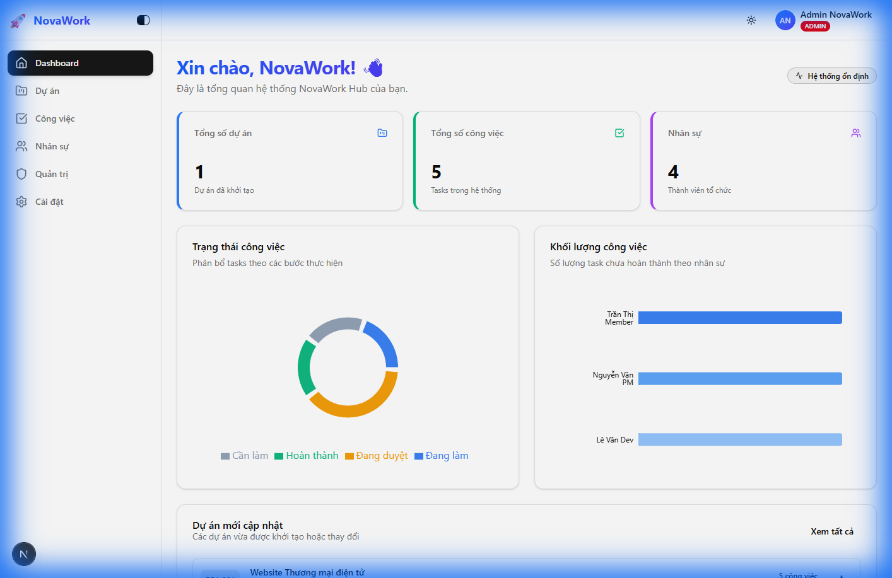
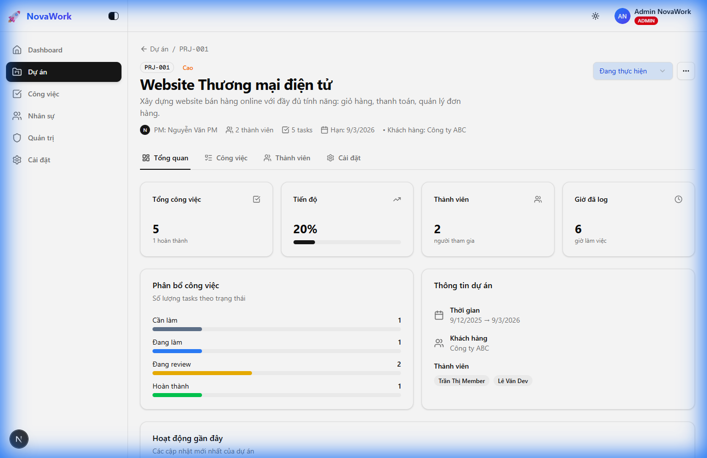
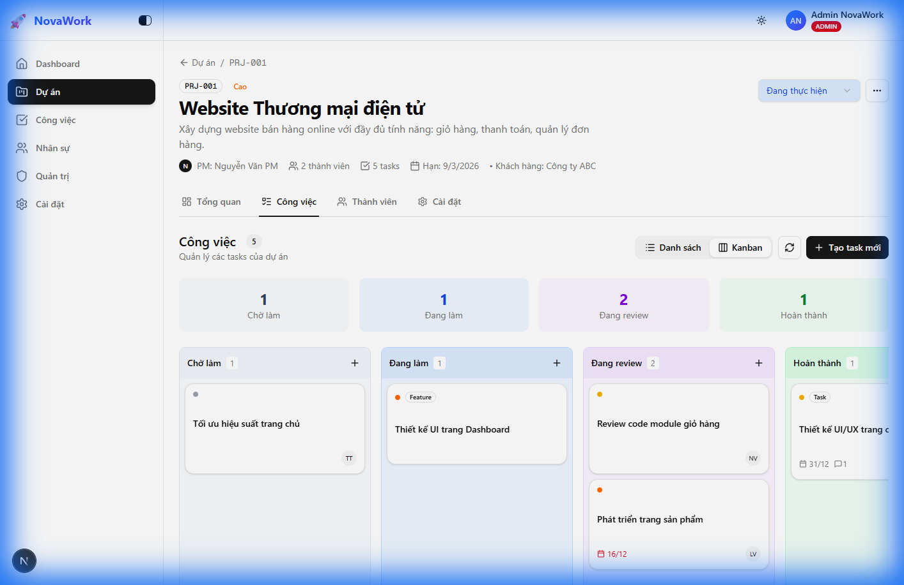
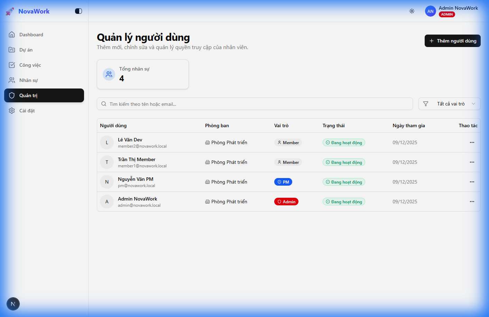

# 🚀 NovaWork Hub - Project Management Platform


**NovaWork Hub** là một nền tảng quản lý dự án và công việc toàn diện, được thiết kế để tối ưu hóa hiệu suất làm việc nhóm và theo sát tiến độ dự án một cách trực quan, hiện đại. Với công nghệ Next.js 15 và thiết kế Glassmorphism, NovaWork mang lại trải nghiệm mượt mà và cao cấp.

---

## ✨ Tính năng nổi bật hiện tại

### 📊 Dashboard Tổng quan
Hệ thống cung cấp cái nhìn toàn cảnh về các dự án đang hoạt động, thống kê trạng thái công việc và khối lượng công việc của từng thành viên thông qua biểu đồ trực quan.



### 📂 Quản lý Dự án (Project Management)
- Tạo và quản lý danh sách dự án với đầy đủ thông tin: Mã dự án, Khách hàng, Ngân sách, Thời gian.
- Theo dõi tiến độ tổng thể của từng dự án.
- Phân quyền quản lý cho Project Manager (PM) và Admin.


### 📋 Trang Chi tiết Dự án
Mỗi dự án có không gian riêng với các tab điều hướng: Tổng quan, Công việc, Thành viên và Cài đặt.



### 📌 Bảng Kanban Thông minh
- Quản lý công việc bằng phương pháp kéo thả (Drag & Drop) mượt mà.
- Phân loại công việc theo trạng thái: Cần làm, Đang làm, Đánh giá, Hoàn thành.
- Cập nhật trạng thái công việc tức thời (Optimistic UI).



### 📝 Chi tiết Công việc & Bình luận
- Xem chi tiết công việc trong một Drawer (Sheet) hiện đại.
- Chỉnh sửa tiêu đề, mô tả, độ ưu tiên và người thực hiện trực tiếp.
- Hệ thống bình luận thời gian thực cho phép trao đổi trực tiếp trên từng task.
- Hỗ trợ đính kèm file và checklist công việc con.

### 👥 Quản trị Người dùng & Phân quyền
- Quản lý danh sách nhân sự trong hệ thống.
- Phân vai trò rõ ràng: Admin, PM, Member, Viewer.
- Dashboard quản trị dành riêng cho Admin.



---

## 🛠 Công nghệ sử dụng

- **Framework:** Next.js 15 (App Router)
- **Programming:** TypeScript
- **Styling:** Tailwind CSS v4 & Lucide Icons
- **Database:** PostgreSQL (Supabase)
- **ORM:** Prisma 7
- **Auth:** Auth.js v5 (NextAuth)
- **UI Components:** Shadcn UI (Radix UI)
- **Library:** @dnd-kit (Kanban), Recharts (Charts), React Hook Form, Zod

---

## 🚀 Hướng dẫn cài đặt nhanh

1. **Clone project:**
   ```bash
   git clone https://github.com/your-username/nova-work-hub.git
   cd nova-work-hub
   ```

2. **Cài đặt dependencies:**
   ```bash
   npm install
   ```

3. **Cấu hình môi trường:**
   Tạo file `.env` và điền các thông tin (tham khảo `.env.example`):
   ```env
   DATABASE_URL="your_postgresql_url"
   DIRECT_URL="your_direct_postgresql_url"
   AUTH_SECRET="your_auth_secret"
   ```

4. **Khởi tạo Database:**
   ```bash
   npx prisma generate
   npx prisma db push
   npx prisma db seed
   ```

5. **Chạy dự án:**
   ```bash
   npm run dev
   ```